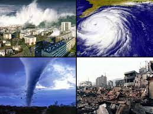
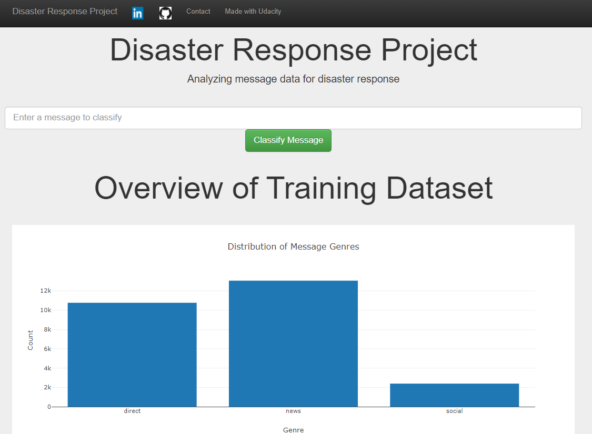
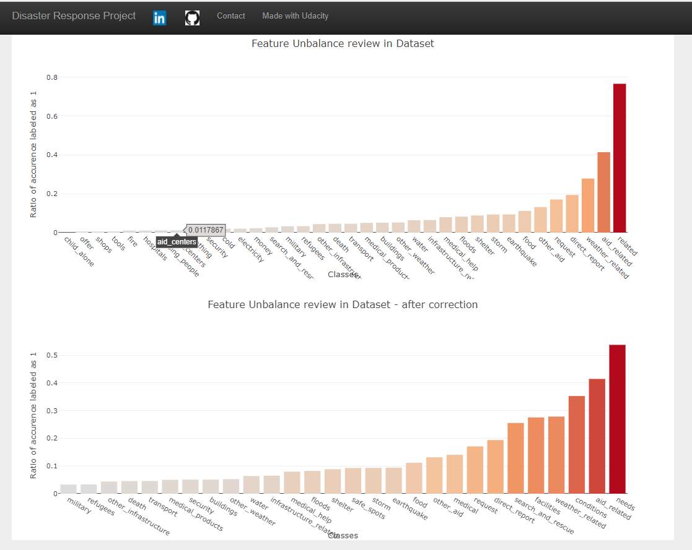

# Disaster_response
Analyzing Disaster response massages pipeline to classify type of call

# Contents

[***Objective***](https://github.com/uriaLevko/Disaster_response#objective)

[***Overview***](https://github.com/uriaLevko/Disaster_response#overview)

[***Components***](https://github.com/uriaLevko/Disaster_response#Components)

[***Files***](https://github.com/uriaLevko/Disaster_response#files)

# Objective

* machine learning pipeline to categorize disaster events
* send the messages to an appropriate disaster relief agency
* disply results in webapp
* provide an API to improve Dataset (on progress)

# Overview

In this project, I analyzed disaster data provided by <a href='https://appen.com/'>Figure Eight</a> to build a model for an API that classifies disaster messages.

The Project dataset contained real messages that were sent during disaster events. 

The aim is creating a machine learning pipeline to categorize these events so that its possible to send the messages to an appropriate disaster relief agency.

The project includes a web app where an emergency worker can input a new message and get classification results in several categories.

Below are a few screenshots of the web app.

<table><tr>
<td>  </td>
    <td></td><td></td>
<td>  </td>
    <td></td><td></td>
</tr></table>

# Components

There are three main components to this project.

1. ETL Pipeline - process_data.py:
* Loads the messages and categories datasets
* Merges the two datasets
* Cleans the data
* Stores it in a SQLite database

2. ML Pipeline - train_classifier.py, a machine learning pipeline that:
* Loads data from the SQLite database
* Splits the dataset into training and test sets
* Builds a text processing and machine learning pipeline
* Trains and tunes a model using GridSearchCV
* Outputs results on the test set
* Exports the final model as a pickle file
3. Flask Web App -
* classes data visualizations using Plotly in the web app.
* input massage to get class classification

# Files
