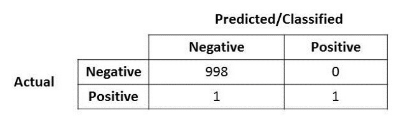
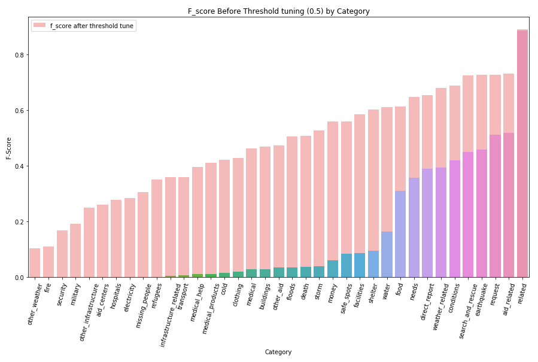
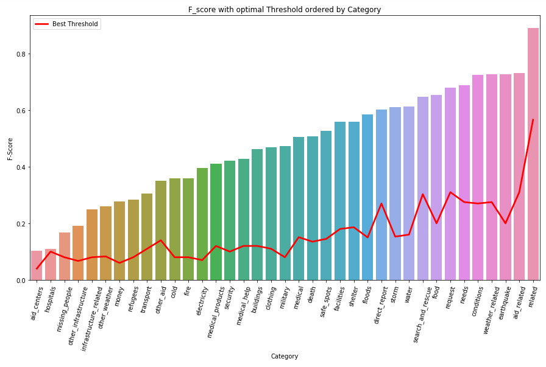

# Disaster_response
Analyzing Disaster response massages pipeline to classify type of call

# Contents

[***Objective***](https://github.com/uriaLevko/Disaster_response#objective)

[***Overview***](https://github.com/uriaLevko/Disaster_response#overview)

[***Metrics Meaning***](https://github.com/uriaLevko/Disaster_response#Metrics_in_the_Disaster_response_domain)

[***Components***](https://github.com/uriaLevko/Disaster_response#Components)

[***Files***](https://github.com/uriaLevko/Disaster_response#files)

[***Results_discussion***](https://github.com/uriaLevko/Disaster_response#Results_discussion)

 
# Objective

* machine learning pipeline to categorize disaster events
* send the messages to an appropriate disaster relief agency
* disply results in webapp
* provide an API to improve Dataset (on progress)

# Overview

In this project, I analyzed disaster data provided by <a href='https://appen.com/'>Figure Eight</a> to build a model for an API that classifies disaster messages.

The Project dataset contained real messages that were sent during disaster events. 

The aim is creating a machine learning pipeline to categorize these events so that its possible to send the messages to an appropriate disaster relief agency.

The project includes a web app where an emergency worker can input a new message and get classification results in several categories.

Below are a few screenshots of the web app.

<table><tr>
<td>  </td>
    <td></td><td></td>
<td>  </td>
    <td></td><td></td>
</tr></table>

# Metrics_in_the_Disaster_response_domain 

<table >

  <tr>
    <th style="background-color:gray">Metric</th>
     <th style="background-color:gray" >What does that even means</th>
    <th style="background-color:#00FF00">Why it's OK</th>
    <th style="background-color:red">Why it's NOT OK</th>
    <th style="background-color:orange">What should we do?</th>
  </tr>
  <tr>
    <td colspan="1" rowspan="2">Precision</td>
    <td>Precision is the measure of how many of our predicted positive (ypred=1) actually were positive (y=1)</td>
    <td rowspan="2">In case of irrelevance  - the call would just be ignored </td>
    <td>In case of Disaster  - many calls will be sent, and that may cause an unnecessary load</td>
    <td rowspan="2">For classes that are'nt life or resource allocation crucial - medium to high threshold should be chosen</td>
  </tr>
  <tr>
    <td>Practically, low rate means we will send many wrong calls to agencies</td>
    <td>There could be a situation where an agency sends resources by mistake - that might cause an insufficient resource allocation for the real needed calls</td>
  </tr>
  <tr>
    <td colspan="1" rowspan="2">Recall</td>
    <td >how many actual positives (y=1) we predicted as positive (y=0)</td>
    <td rowspan="2">Some topics are not crucial and can go undetected like reports that aren’t important for help</td>
    <td >practically - that means agencies will not get the distress call - because it will be classified as False by mistake</td>
    <td rowspan="2">For classes that Are life or resource allocation crucial - low to  threshold should be chosen</td>
    </tr>
    <tr>
    <td >Low Recall means a High False Negative rate. In case of emergency, its crucial not to miss any stress calls that revolve saving life’s</td>
    <td >In this domain - for life saving classes, there soul'd be an attempt to get the lowest FN rate as possible</td>
    </tr>
</table>

# Components

There are three main components to this project.

1. ETL Pipeline - process_data.py:
* Loads the messages and categories datasets
* Merges the two datasets
* Cleans the data
* Stores it in a SQLite database

2. ML Pipeline - train_classifier.py, a machine learning pipeline that:
* Loads data from the SQLite database
* Splits the dataset into training and test sets
* Builds a text processing and machine learning pipeline
* Trains and tunes a model using GridSearchCV
* Outputs results on the test set
* Exports the final model as a pickle file
3. Flask Web App -
* classes data visualizations using Plotly in the web app.
* input massage to get class classification

# Files

[__Notebook 1__](/Files/ETL_Pipeline_Preparation_.ipynb) : ETL

[__Notebook 2__](/Files/ML Pipeline PreparationF.ipynb) : ML Pipeline

[__Complete_Project__](/Files/disaster-response-pipeline-project): Full project

# Results_discussion

## Unballanced situation
looking at the image above, it's clear we are dealing with a highly imballanced dataset where only 3 classes has more then 20% minority class ratio, and many classes are pretty much all labeled as False.
*This is not an easy situation, and among the techniques to deal with it I would emphasize the following (there are meny any more):*
1. Data improvement:
 * Undersampling the Majority Class
 * Oversampling the Minority Class
 * Combine Data Undersampling and Oversampling
 * Cost-Sensitive Algorithms
 * Feature engineering
2. Threshold-Moving for Imbalanced Classification:
 * Converting Probabilities to Class Labels
 * Threshold-Moving for Imbalanced Classification
 * Optimal Threshold for ROC Curve
 * Optimal Threshold for Precision-Recall Curve
 * Optimal Threshold Tuning

At this point, no such techniques were used at this project, but I plan on improving the results in the near future.
## Precision vs. Recall

*by undertanding that we are dealing with a highly imbalanced dataset, some point needs to be taken in considiration when analazig the current results:*

1. We can't use accuracy as a metric as it will produce excelent results due to the imbalance

2. According to the imbalance in class (positive or negative) to the topic, we will have to choose the right metric:
 * Precision: appropriate when minimizing false positives is the focus - appropriate classes that demand high resource allocation but are not life saving.
 * Recall: Appropriate when minimizing false negatives is the focus - apropriate classes that are highly life saving.
 * F-Measure: provides a way to combine both precision and recall into a single measure that captures both properties.
 
3. No single threshold can be activated  for all classes, and we will have to change threshold according to:
 * Class imbalance (positive or negative).
 * Metric selection (logical class determines the metric).
 * use of ROC curves as indicators.
4. Below there is a comparison of Threshold tuning with effect on the results. The impact is dramatic.
 
<!-- <table><tr>
<td>  </td>
    <td></td><td></td>
<td>  </td>
    <td></td><td></td>
</tr></table> -->

 
LICENSE: This project is licensed under the terms of the esri license product. There is no approval to copy or use this code without permission
